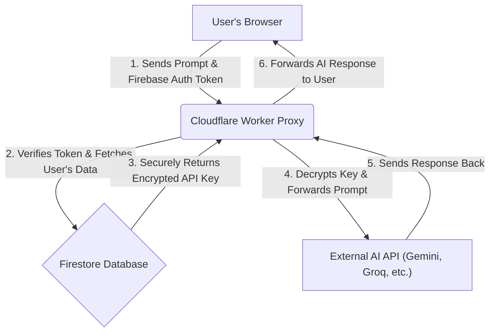

  
  <h1>Zyren Chat</h1>
  
<strong>A Private, Secure, and Infinitely Customizable AI Chat Experience.</strong>

  
  

    <a href="https://zyren.web.app"><strong>Try the Live Demo →</strong></a>
  

  
  

    
    
    
    
  

---

## 🚀 What is Zyren Chat?

Zyren Chat is a sleek, modern chat interface that puts **your privacy and control first**. Unlike other AI chat services, Zyren operates on a "Bring Your Own Key" (BYOK) model. This means you connect your personal API keys from various AI providers, and your conversations happen directly between you and the AI, secured by an enterprise-grade serverless proxy.

**We never see your API keys or your chat conversations. Ever.**

This project started as a fork of Gemna Chat and has been rebuilt to offer a completely independent, secure, and rebranded experience.

## ✨ Key Features

-   🔐 **Ultimate Privacy & Security:** All API calls are routed through a secure Cloudflare Worker. Your keys are encrypted in your private database and are never exposed to the browser.
-   🔑 **Bring Your Own Key (BYOK):** Full support for your personal API keys from:
    -   Google Gemini
    -   Groq
    -   OpenRouter
-   ☁️ **Cloud Synchronization:** With Firebase Authentication, all your characters, chats, and settings are securely synced across your devices.
-   🤖 **Custom AI Personas:** Create unique AI characters with distinct personalities, languages, and texting styles. Or, create complex group chats with multiple AI participants.
-   🎨 **Customizable Interface:** Choose from multiple themes that mimic popular messaging apps (iMessage, WhatsApp, etc.) and toggle between light and dark modes.
-   🔄 **Data Portability:** Easily import and export your characters and chat histories as `.json` files.
-   🗣️ **Text-to-Speech:** Have the AI's responses read aloud with a voice that intelligently matches its persona (powered by Gemini).
-   🖼️ **AI Image Generation:** Use `/image` and `/sendpic` commands to generate images directly in the chat.
-   📱 **Progressive Web App (PWA):** Install Zyren Chat on your desktop or mobile device for a native-app-like experience.

## 🏛️ Secure Architecture Explained

The core of Zyren Chat's privacy model is its architecture. Your browser **never** communicates directly with the AI provider's API. Instead, it follows this secure flow:

This ensures your secret keys are only ever decrypted and used in the secure, serverless environment of the Cloudflare Worker.

## 🛠️ Tech Stack

-   **Frontend:** HTML5, Tailwind CSS, Vanilla JavaScript (ESM)
-   **Backend & Cloud:**
    -   **Firebase:** Authentication, Firestore (Database), Hosting
    -   **Cloudflare Workers:** Secure API Proxy
-   **APIs:** Google Gemini, Groq, OpenRouter

## 🚀 Getting Started Locally

To run your own instance of Zyren Chat, you'll need two main components: the frontend application and the secure worker proxy.

### Prerequisites
-   Node.js and npm
-   Firebase CLI (`npm install -g firebase-tools`)
-   Cloudflare Wrangler CLI (`npm install -g wrangler`)

### 1. Frontend Setup (Firebase)
1.  Clone this repository: `git clone https://github.com/exanx/zyren.git`
2.  Navigate to the project directory: `cd zyren`
3.  Set up your own Firebase project and create a new Web App.
4.  In `public/index.html`, replace the placeholder `firebaseConfig` object with your own.
5.  Run `firebase serve` to test locally.
6.  Deploy with `firebase deploy --only hosting`.

### 2. Backend Proxy Setup (Cloudflare)
The proxy code is located in the `zyren-api-proxy` directory.

1.  Navigate to the proxy directory: `cd zyren-api-proxy`
2.  Install dependencies: `npm install`
3.  Go to your new Firebase project's settings, under "Service Accounts," and generate a new private key. This will download a JSON file.
4.  Run `wrangler secret put FIREBASE_SERVICE_ACCOUNT` and paste the entire content of the downloaded JSON file.
5.  In `src/index.js`, update the `FIREBASE_PROJECT_ID` and the `Access-Control-Allow-Origin` URL to match your project.
6.  Deploy the worker: `wrangler deploy`
7.  Copy the URL provided by Wrangler and paste it into the `proxyUrl` variable in your main `public/index.html` file.

## 🗺️ Future Roadmap

-   [ ] Real-time streaming for AI responses.
-   [ ] Support for more AI providers.
-   [ ] In-app message editing and regeneration.
-   [ ] More advanced persona creation tools.
-   [ ] UI/UX enhancements and new themes.

## 🤝 Contributing

Contributions, issues, and feature requests are welcome! Feel free to check the [issues page](https://github.com/exanx/zyren/issues).

## 📄 License

This project is licensed under the MIT License. See the `LICENSE` file for details.
